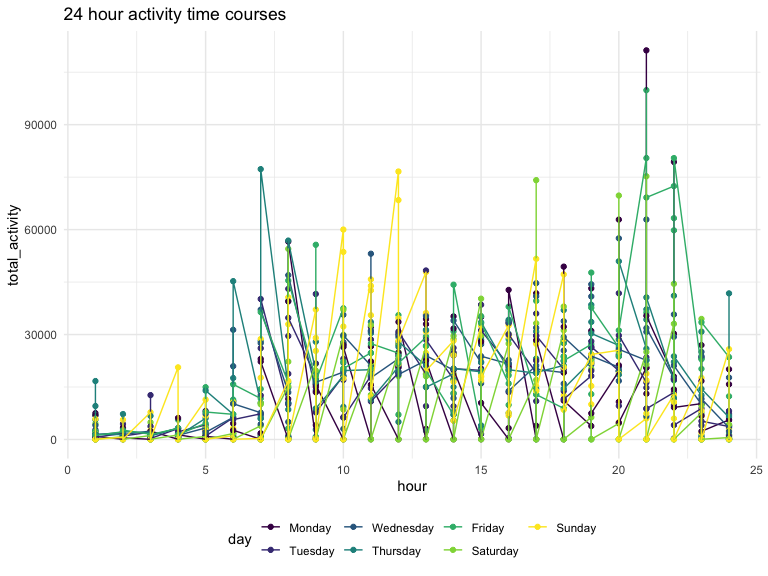
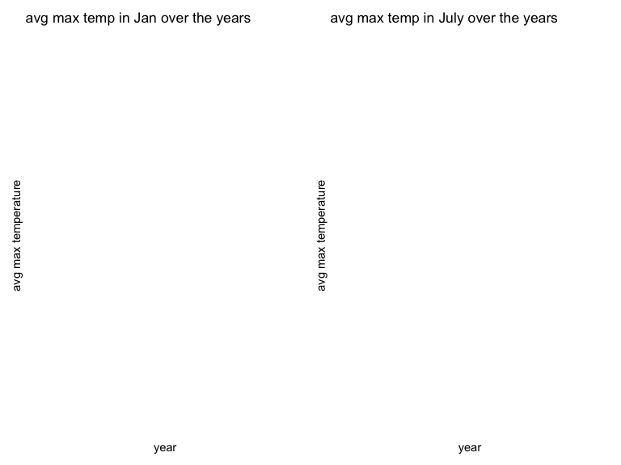

Homework 3
================
Juan Cambeiro
2022-10-17

### Problem 1

#### Read in the data

``` r
data("instacart")

instacart = 
  instacart %>% 
  as_tibble(instacart)
```

#### Answer questions about the data

This dataset contains 1384617 rows and 15 columns, with each row
resprenting a single product from an instacart order. Variables include
identifiers for user, order, and product; the order in which each
product was added to the cart. There are several order-level variables,
describing the day and time of the order, and number of days since prior
order. Then there are several item-specific variables, describing the
product name (e.g. Yogurt, Avocado), department (e.g. dairy and eggs,
produce), and aisle (e.g. yogurt, fresh fruits), and whether the item
has been ordered by this user in the past. In total, there are 39123
products found in 131209 orders from 131209 distinct users.

Below is a table summarizing the number of items ordered from aisle. In
total, there are 134 aisles, with fresh vegetables and fresh fruits
holding the most items ordered by far.

``` r
instacart %>% 
  count(aisle) %>% 
  arrange(desc(n))
```

    ## # A tibble: 134 × 2
    ##    aisle                              n
    ##    <chr>                          <int>
    ##  1 fresh vegetables              150609
    ##  2 fresh fruits                  150473
    ##  3 packaged vegetables fruits     78493
    ##  4 yogurt                         55240
    ##  5 packaged cheese                41699
    ##  6 water seltzer sparkling water  36617
    ##  7 milk                           32644
    ##  8 chips pretzels                 31269
    ##  9 soy lactosefree                26240
    ## 10 bread                          23635
    ## # … with 124 more rows

Next is a plot that shows the number of items ordered in each aisle.
Here, aisles are ordered by ascending number of items.

``` r
instacart %>% 
  count(aisle) %>% 
  filter(n > 10000) %>% 
  mutate(aisle = fct_reorder(aisle, n)) %>% 
  ggplot(aes(x = aisle, y = n)) + 
  geom_point() + 
  labs(title = "Number of items ordered in each aisle") +
  theme(axis.text.x = element_text(angle = 60, hjust = 1))
```


Our next table shows the three most popular items in aisles
`baking ingredients`, `dog food care`, and `packaged vegetables fruits`,
and includes the number of times each item is ordered in your table.

``` r
instacart %>% 
  filter(aisle %in% c("baking ingredients", "dog food care", "packaged vegetables fruits")) %>%
  group_by(aisle) %>% 
  count(product_name) %>% 
  mutate(rank = min_rank(desc(n))) %>% 
  filter(rank < 4) %>% 
  arrange(desc(n)) %>%
  knitr::kable()
```

| aisle                      | product_name                                  |    n | rank |
|:---------------------------|:----------------------------------------------|-----:|-----:|
| packaged vegetables fruits | Organic Baby Spinach                          | 9784 |    1 |
| packaged vegetables fruits | Organic Raspberries                           | 5546 |    2 |
| packaged vegetables fruits | Organic Blueberries                           | 4966 |    3 |
| baking ingredients         | Light Brown Sugar                             |  499 |    1 |
| baking ingredients         | Pure Baking Soda                              |  387 |    2 |
| baking ingredients         | Cane Sugar                                    |  336 |    3 |
| dog food care              | Snack Sticks Chicken & Rice Recipe Dog Treats |   30 |    1 |
| dog food care              | Organix Chicken & Brown Rice Recipe           |   28 |    2 |
| dog food care              | Small Dog Biscuits                            |   26 |    3 |

Finally is a table showing the mean hour of the day at which Pink Lady
Apples and Coffee Ice Cream are ordered on each day of the week. This
table has been formatted in an untidy manner for human readers. Pink
Lady Apples are generally purchased slightly earlier in the day than
Coffee Ice Cream, with the exception of day 5.

``` r
instacart %>%
  filter(product_name %in% c("Pink Lady Apples", "Coffee Ice Cream")) %>%
  group_by(product_name, order_dow) %>%
  summarize(mean_hour = mean(order_hour_of_day)) %>%
  spread(key = order_dow, value = mean_hour) %>%
  knitr::kable(digits = 2)
```

    ## `summarise()` has grouped output by 'product_name'. You can override using the
    ## `.groups` argument.

| product_name     |     0 |     1 |     2 |     3 |     4 |     5 |     6 |
|:-----------------|------:|------:|------:|------:|------:|------:|------:|
| Coffee Ice Cream | 13.77 | 14.32 | 15.38 | 15.32 | 15.22 | 12.26 | 13.83 |
| Pink Lady Apples | 13.44 | 11.36 | 11.70 | 14.25 | 11.55 | 12.78 | 11.94 |

### Problem 2

#### Load, clean, tidy, mutate

Here I am loading the accelerometer data, cleaning it, and tidying it
using `pivot_longer`. Then, I am mutating the data using `mutate` so as
to create a new ‘weekday_vs_weekend’ variable and to encode data with
reasonable variable classes.

``` r
accel_data = read_csv("data/accel_data.csv") %>%
  janitor::clean_names() %>%
  pivot_longer(
    activity_1:activity_1440,
    names_to = "minutes",
    values_to = "activity_count",
    names_prefix = "activity_") %>%
  mutate(
  weekday_vs_weekend = as.factor(ifelse(day == "Saturday" | day == "Sunday", "weekend", "weekday")),
  day = as.factor(ordered(day, levels = c("Monday", "Tuesday", "Wednesday", "Thursday", "Friday", "Saturday", "Sunday"))),
  minutes = as.double(minutes))
```

    ## Rows: 35 Columns: 1443
    ## ── Column specification ────────────────────────────────────────────────────────
    ## Delimiter: ","
    ## chr    (1): day
    ## dbl (1442): week, day_id, activity.1, activity.2, activity.3, activity.4, ac...
    ## 
    ## ℹ Use `spec()` to retrieve the full column specification for this data.
    ## ℹ Specify the column types or set `show_col_types = FALSE` to quiet this message.

Description: This dataset contains 50400 observations and 6 variables.
Each observation is a minute of accelerometer data for the 63 year-old
male over five weeks. The variables include: week (`week`), day ID
(`day_id`), day of the week (`day`), minute (`minutes`), activity count
per minute (`activity_count`), and whether it is on a weekday or weekend
(`weekday_vs_weekend`).

#### Aggregating across minutes to create total activity variable

I will now use my tidied dataset to aggregate across minutes to create a
total activity variable for each day, and create a table showing these
totals.

``` r
accel_data %>%
  group_by(week, day) %>%
  summarize(total_activity = sum(activity_count)) %>%
  pivot_wider(
    names_from = "day",
    values_from = "total_activity") %>%
  knitr::kable()
```

    ## `summarise()` has grouped output by 'week'. You can override using the
    ## `.groups` argument.

| week |    Monday |  Tuesday | Wednesday | Thursday |   Friday | Saturday | Sunday |
|-----:|----------:|---------:|----------:|---------:|---------:|---------:|-------:|
|    1 |  78828.07 | 307094.2 |    340115 | 355923.6 | 480542.6 |   376254 | 631105 |
|    2 | 295431.00 | 423245.0 |    440962 | 474048.0 | 568839.0 |   607175 | 422018 |
|    3 | 685910.00 | 381507.0 |    468869 | 371230.0 | 467420.0 |   382928 | 467052 |
|    4 | 409450.00 | 319568.0 |    434460 | 340291.0 | 154049.0 |     1440 | 260617 |
|    5 | 389080.00 | 367824.0 |    445366 | 549658.0 | 620860.0 |     1440 | 138421 |

Above we can see a table showing the totals for each day.

#### Making plot that shows the 24-hour activity time courses for each day

I will now make a single-panel plot that shows the 24-hour activity time
courses for each day.

``` r
accel_data  %>%
  mutate(
  hour = as.numeric(rep(rep(seq(1,24), each = 60), 35))) %>%
  group_by(week, day, hour) %>%
  summarize(total_activity = sum(activity_count)) %>%
  ggplot(aes (x = hour, y = total_activity, color = day)) +
  geom_point() +
  geom_line() +
  labs(title = "24 hour activity time courses")
```

    ## `summarise()` has grouped output by 'week', 'day'. You can override using the
    ## `.groups` argument.


In the above plot it is clear that activity levels are low in the early
hours of the morning, presumably since this is when people are sleeping.
Activity levels seem to be highest in the evening around 9PM. Activity
levels do not seem to vary all that much by day of the week.

### Problem 3

#### Load data

First, I am loading the NOAA data.

``` r
library(p8105.datasets)
data("ny_noaa")
```

Description: This dataset contains 2595176 observations and 7 variables.
The variables include: weather station id (`id`), date of observation
(`date`), precipitation (`prcp`), snowfall (`snow`), snow depth
(`snwd`), maximum temperature (`tmax`), and minimum temperature
(`tmin`). Missing data seems to be a significant issue: for
precipitation (`prcp`) there are 145838 missing values, for snowfall
(`snow`) there are 381221 missing values, for snow depth (`snwd`) there
are 591786 missing values, for maximum temperature (`tmax`) there are
1134358 missing values, and for minimum temperature (`tmin`) there are
1134420 missing values.

#### Data cleaning

Next, I am cleaning the data and I will create separate variables for
year, month, and day using `separate`. I am also using `mutate` to
encode data with reasonable variable classes and units.

``` r
ny_noaa_cleaned = ny_noaa %>%
  janitor::clean_names() %>%
  separate (col = date, into = c("year", "month", "day"), sep = "-") %>%
  mutate(
    year = as.factor(year),
    month = as.factor(month),
    day = as.integer(day),
    tmin = as.numeric(tmin),
    tmax = as.numeric(tmax))
```

#### Most commonly observed value(s) for snowfall

Next, I will find the most commonly observed values for snowfall.

``` r
ny_noaa_cleaned %>%
  group_by(snow) %>%
  summarize(snowfall = n()) %>%
  arrange(desc(snowfall))
```

    ## # A tibble: 282 × 2
    ##     snow snowfall
    ##    <int>    <int>
    ##  1     0  2008508
    ##  2    NA   381221
    ##  3    25    31022
    ##  4    13    23095
    ##  5    51    18274
    ##  6    76    10173
    ##  7     8     9962
    ##  8     5     9748
    ##  9    38     9197
    ## 10     3     8790
    ## # … with 272 more rows

The most commonly observed value for snowfall is 0 because most days it
does not snow at all. The second most common observed value is NA
because there is a substantial number of missing values.

#### Plot showing the average max temperature in January and in July in each station across years

Now, I will do a two-panel plot showing the average max temperature in
January and in July in each station across years.

``` r
avg_jan = ny_noaa_cleaned %>%
  filter(month == "1") %>%
  filter(!is.na(tmax)) %>%
  group_by (id, year) %>%
  summarize (avg_tmax = mean(tmax)) %>%
  ggplot(aes(x=year, y=avg_tmax, group=id, color=id)) +
  geom_line(show.legend=FALSE) +
  labs (title = "avg max temp in Jan over the years",
        x = "year",
        y = "avg max temperature")
```

    ## `summarise()` has grouped output by 'id'. You can override using the `.groups`
    ## argument.

``` r
avg_july = ny_noaa_cleaned %>%
  filter(month == "7") %>%
  filter(!is.na(tmax)) %>%
  group_by (id, year) %>%
  summarize (avg_tmax = mean(tmax)) %>%
  ggplot(aes(x=year, y=avg_tmax, group=id, color=id)) +
  geom_line(show.legend=FALSE) +
  labs (title = "avg max temp in July over the years",
        x = "year",
        y = "avg max temperature")  
```

    ## `summarise()` has grouped output by 'id'. You can override using the `.groups`
    ## argument.

``` r
(avg_jan + avg_july)
```


